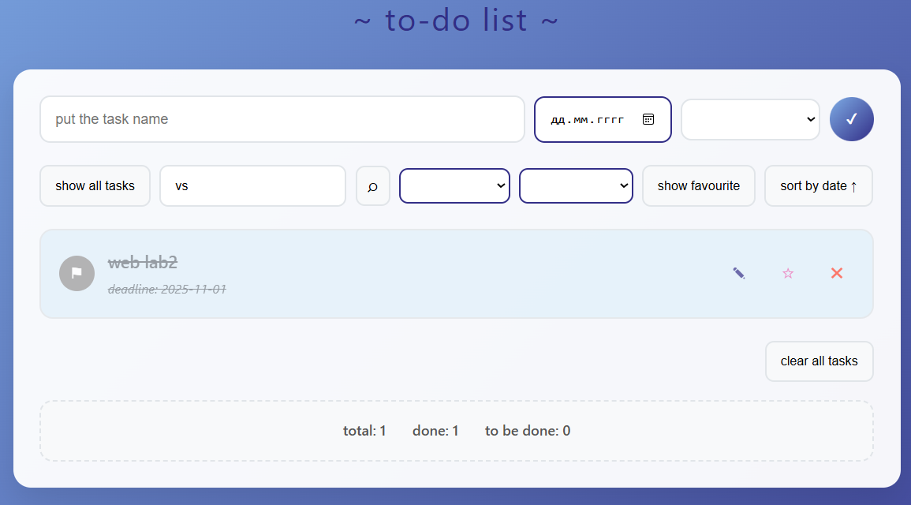

# web-lab2-to-do-list

## Задача
Разработать веб-приложение To-Do-лист, где пользователь сможет создавать, редактировать и удалять задачи, отмечать их как выполненные, фильтровать, сортировать и искать, а также менять порядок задач с помощью drag-and-drop.

[Deploy](https://aleksashako.github.io/itmo-web-dev/public/lab2/) реализованного to-do list. 
Работа выполнена на чистом JavaScript с использованием семантических тегов и методов DOM, при этом HTML-файл содержит только базовый каркас и подключение скрипта. Все текстовые элементы, атрибуты, стили также добавлены через JavaScript. Реализована адаптивность через CSS @media, которая обеспечивает корректное отображение на различных устройствах и форматах экранов.

## Логика приложения

#### Стартовый экран

### Реализованы следующие функции в to-do листе:
* добавление новой задачи в список

У неё обязательно должно быть название/текст, дата==дедлайн не является обязательным, а также добавлен тип (`study`, `life`, `work`, `family&friends`, `other`, либо его отсутствие = `empty`) - для более наглядного отображения (обозначены разными цветами) и большей возможности фильтрации.

* возможность отмечать задачу как выполненную с изменением визуального оформления (зачеркивание названия задачи и дедлайна, а также изменение цвета на более тусклый)

* редактирование задачи (текст и дата)  содержит возможность сохранить изменения ИЛИ вернуться к исходному варианту

* добавление задачи в избранное (и её удаление оттуда)

* удаление задачи из списка, а также полное очищение списка задач

### В панели управления реализованы:
* отображение всех задач

* поиск задач по название (как с помощью специальнойкпонки, так и с помощью Enter)

* фильтрация задач по статусу (done/not done)

* фильтрацию задач типу (study-задачи, family&friends-задачи и т.д.)

* отображение избранных задач

* сортировка задач по дате

Наиболее логичным мне показалось снаачла отображать задачи с дедлайнами, а потом уже без них (так как они необзательные по дефолту).

Дополнительно в нижней части основного контейнера добавлена небольшая статистика, отражающая общее число задач, сколько их них выполнено и сколько еще требует выполнения.

Реализована возможность менять порядок задач с помощью drag-and-drop (при этом их id меняются и все вышеперечисленные действия сохраняются)

> Также обеспечено сохранение задач и их парметров в localStorage и полное восстановление при загрузке страницы.

> Добавлен фавикон страницы.
