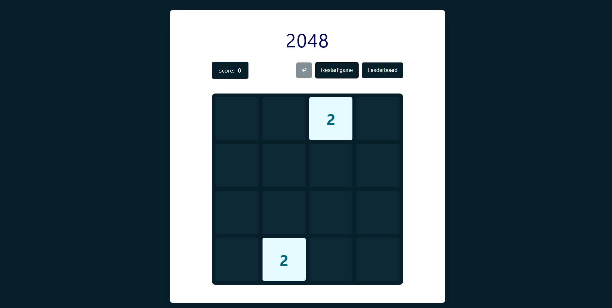
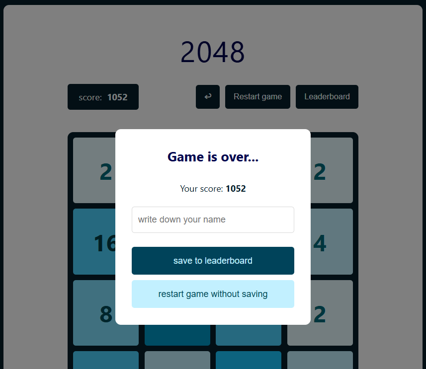
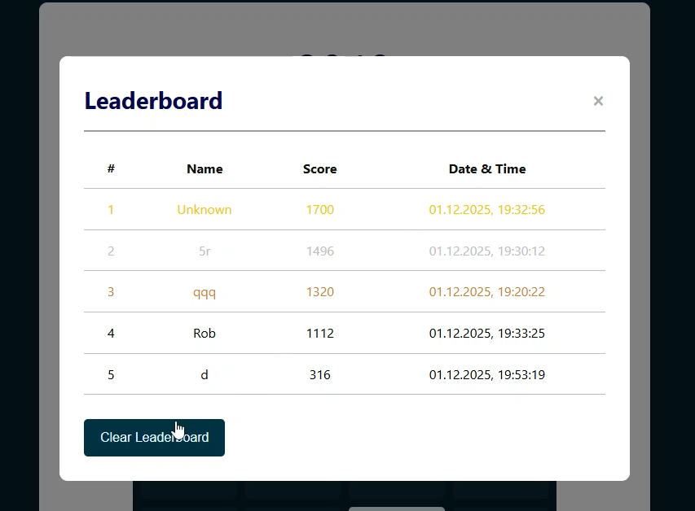
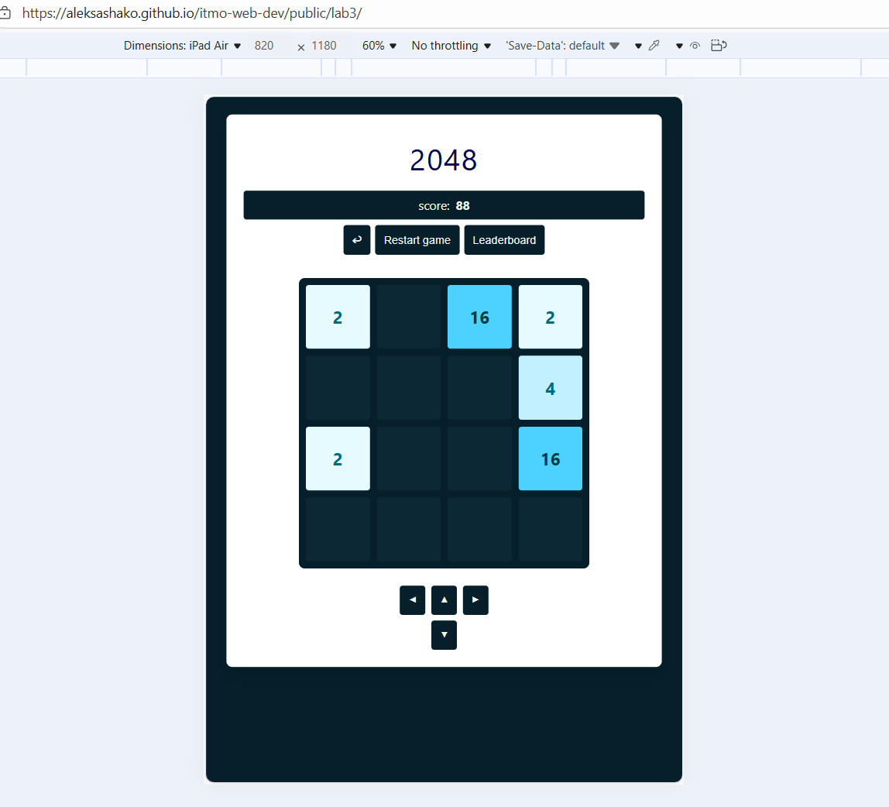

# web-lab3-game-2048

## Задача
Разработать веб-версию игры 2048, где помимо основной функции - игры, реализована отмена хода, сохранение счёта игры в leaderboard по завершении игры, отображение топ-10 результатов.

[Deploy](https://aleksashako.github.io/itmo-web-dev/public/lab3/) реализованной игры. 
Работа выполнена на чистом JavaScript с использованием семантических тегов и методов DOM, при этом HTML-файл содержит только базовый каркас и подключение скрипта. Все текстовые элементы, атрибуты, стили также добавлены через JavaScript. Реализована адаптивность через CSS @media, которая обеспечивает корректное отображение на различных устройствах и форматах экранов.

## Логика приложения
* Сетка 4x4 генерируется динамически с помощью JavaScript, хранится в виде двумерного массива
* Новая плитка появляется в случайной свободной ячейке. В начале игры на поле есть плитки со значениями "2" или "4"

* Слияние плиток однаковых чисел работает во всех направлениях (left, right, up, down)
* После каждого хода корректно появляется 1-2 новых плитки со значениями "2" или "4"

https://github.com/user-attachments/assets/f824d28e-b91f-49e7-90ce-e007a89a3970

* Корректный расчет и отображение очков (Очки считаются путем суммирования значений объединенных ячеек за предыдущий ход)
При этом слияние клеток по условию лабораторной работы реальзовано не так как в классической игре, а до "победного", то есть за один slide в любом направлении, merge происходит до того момента, пока рядом не будут находиться одинаковые ячейки

* При завершении игры отображается модальное окно - информационное сообщение о завершении игры, счёт, input для ввода имени (опционально, иначе заполняется Unknown), кнопка "save result to leaderboard", кнопка "restart without saving"
При вводе имени и нажатии кнопки "save result": input, счёт и кнопки скрываются, сообщение изменяется на "Result saved to leaderboard!", появляется кнопка "restart". Для выхода из модального окна - нажать вне окна.

## Взаимодействие вне игрового поля

* Реализована проверка на окончание игры (нет возможных ходов во все стороны)

* Кнопка "Restart" сбрасывает состояние поля и счет (без перезагрузки страницы)

https://github.com/user-attachments/assets/bab1c46a-3cd4-4e60-b82d-f909f9748d58

* Реализована кнопка отмены хода "↩" (undo)

https://github.com/user-attachments/assets/9da2d9cb-d407-459c-999d-9f138067362a

  
* В таблице рекордов содержится топ-10 рекордов, которые сохранил пользователь (в localStorage).

Она содержит: позицию в рейтинге, имя игрока, количество очков, дата-время рекорда.

Визуальное дополнение - первые три строки окрашены в золотой, серебряный и бронзовый цвета

## Взаимодействие с игрой

* Поддержка управления кнопками клавиатуры для десктопа и виртуальными кнопками на мобильных устройствах

* Состояние игрового поля, как и счёт, сохраняются в localStorage

## Визуальное отображение

* Каждое значение плитки имеет свой цвет.
Для своей реализации я отошла от классической расцетки и представила в голубо-синей палитре

* Плавная анимация движения и слияния плиток обеспечена с помощью css параметра `transition: all 0.3s ease-in-out;` для класса tile.

