# web-lab4-WeatherForecast

## Задача
`-` создать веб-приложение с прогнозом погоды, получающее информацию о погодных условиях с помощью http-запросов к API

[Deploy](https://aleksashako.github.io/itmo-web-dev/public/lab4/) реализованного приложения. 

[Видеодемонстрация]() 

Работа выполнена на чистом JavaScript с использованием семантических тегов и методов DOM, HTML-файл содержит только базовый каркас и подключение скриптов. Все текстовые элементы, атрибуты и т.д. добавлены через JavaScript. Реализована адаптивность через CSS @media, которая обеспечивает корректное отображение на различных устройствах и форматах экранов.


## Этапы разработки

* Адативный дизайн и медиазапросы: приложение корректно отображается на мобильных (погоду на три дня текущего города можно посмотреть свайпом вправо) и на десктопных устройствах


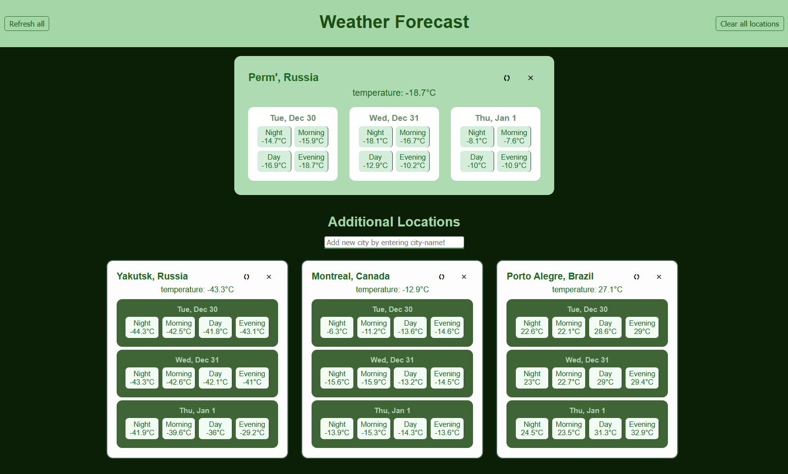

* Две части веб-приложения: в верхней части экрана - карточка текущего местоположение, далее блок - `Additional Locations`, где по желанию можно добавить и отслеживать погоду в других городах (для этого реализована form)

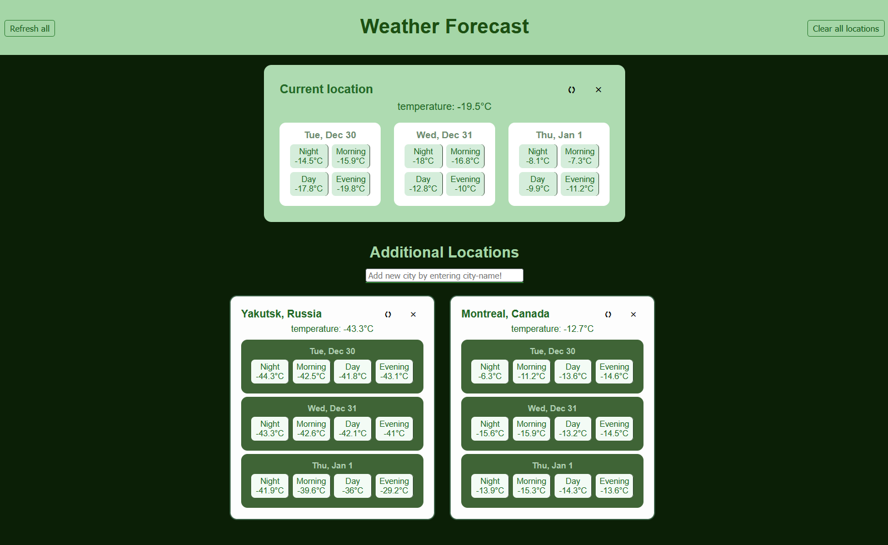

* В header'е страницы есть две кнопки: `Refresh all` для перезагрузки данных по всем локациям, а также `Clear all locations` для удаления всех городов из Additional locations, также каждый город можно удалить отдельно


* При удлаении текущего местоположения принудительно появляется форма заполнения города(!)

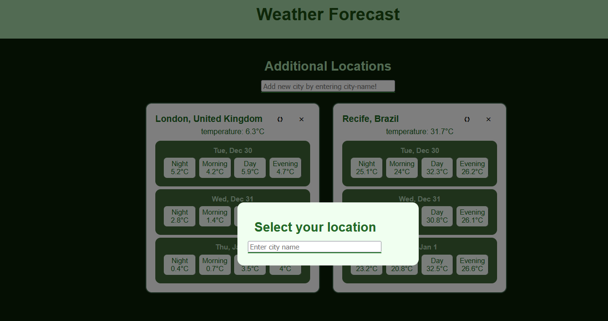


## Добавление логики

* При первом открытии страницы запрашивается доступ к геолокации:
    - при разрешении: автоматически определяются координаты местности, выводится `current location`, без названия

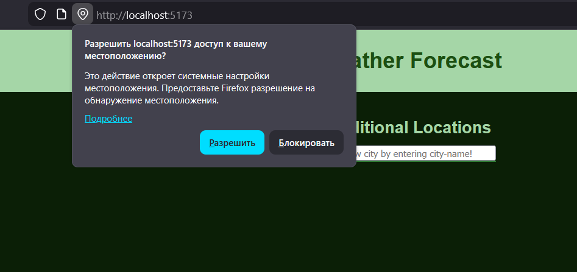

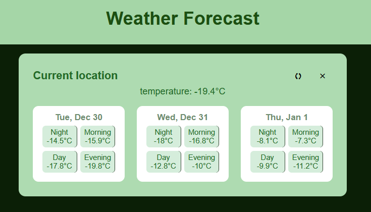

* второй вариант:
    - при блокировке доступа: появляется модальное окно для ввода города текстом, в таком случае пишется не `Current location`, а точное место `City, Country`

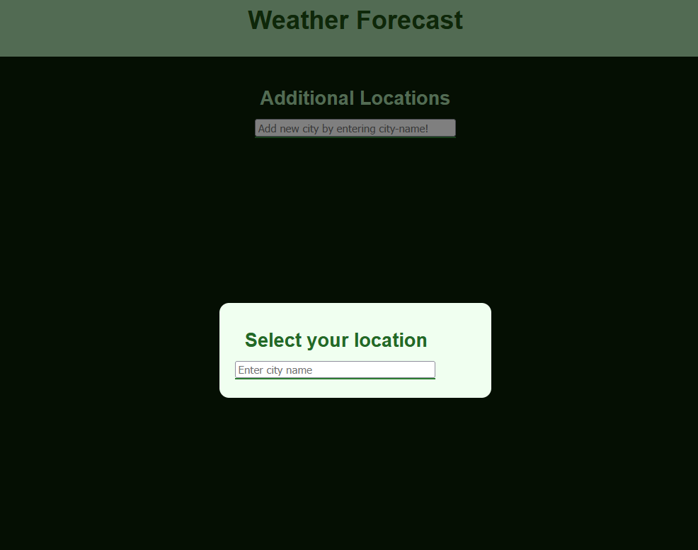

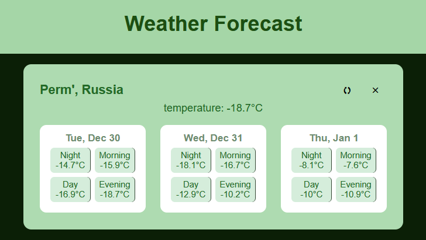

* Для каждой локации отображается температура на ближайшие 3 дня (сегодня + 2) и 4 отметки времени суток (ночь - 00:00-06:00, утро - 06:00-12:00, ...)


* Получение информации о прогнозе погоды осуществляется при помощи http-запросов, используемый инструмент для создания http-запросов - fetch
```
async function fetchWeatherByCoords(lat, lon) {
    const url = `${API_URL}?latitude=${lat}&longitude=${lon}` +
        `&current_weather=true` +
        `&hourly=temperature_2m,weathercode` +
        `&timezone=auto`;

    try {
        const response = await fetch(url);

        if (!response.ok) {
            throw new Error('Weather request failed');
        }

        const data = await response.json();
        return data;
    } catch (error) {
        console.error('fetching error:', error);
        throw error;
    }
}
```


* Температуру любой локации можно перезагрузить, то есть отправить новый запрос к API 

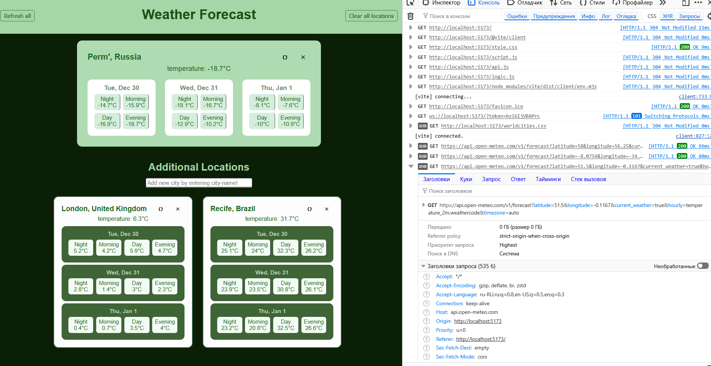

* Отображаются состояния загрузки (при нажатии кнопок `refresh` у каждой локации - сначала `loading...`, потом если успех - погода, иначе - ошибка), ошибки при осуществлении http-запросов выводят в карточке локации

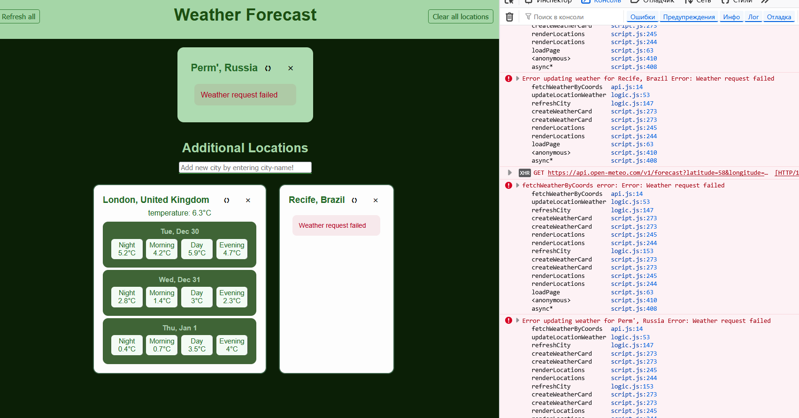

* При вводе текста для добавлении города у пользователя появляется выпадающий список (я реализовала этот список с помощью парсинга csv датсета с kaggle, хранится в виде списка worldsities)

* Пользователь может добавить только существующий город: при введении некорректного города выводится соответствующая ошибка (под полем ввода)

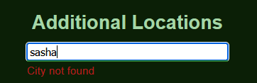

* Аналогично реализована проверка на допустимое количество `Additional location`, их макисмум - 5, при достижении этого числа и попытке добавить новый город -> ошибка

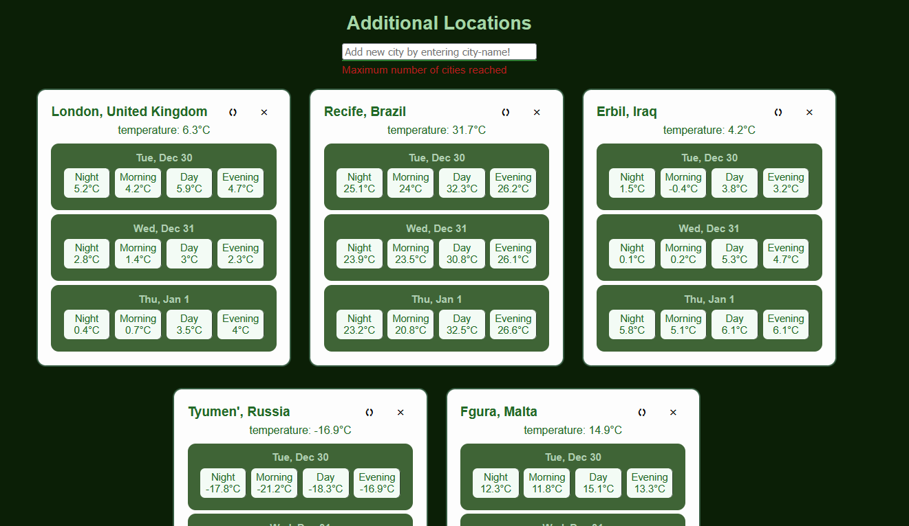

* Третья проверка - на наличие желаемого города в списке. То есть нельзя дважды добавить один и тот же город в `Additional Locations`, при этом, если этот город является текущим - противоречия нет.

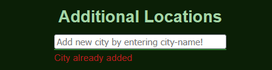

* Информация, введенная пользователем (это текущий город и всё из списка Additional, в том числе их долгота и широта), сохраняется в localStorage.
При этом запрос на получение актуальных погодных условий отправляется каждый раз при refresh/reload page


* Скрипты разделены на 3 файла:

    - `script.js` - как обычно реализована загрузка страницы, функции для хранения в localStorage, в также все функция для создания доп. объектов - карточек, модальных окон

    - `api.js` - одна функция для отправления запроcов к API - `fetchWeatherByCoords`

    - `logic.js` - реализованы функции обновления погоды, то есть обращение к `fetchWeatherByCoords`, а также фунеция для оператирования городами: Add/Refresh/Update/Search

